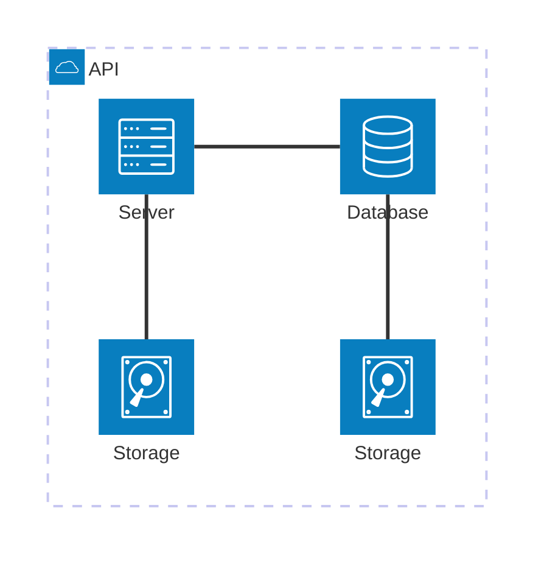

# Modelo de Machine Learning - Árvore de Decisões

Para esse projeto, baixei um dataset no <a href="https://kaggle.com" target="_blank"><b>Kaggle</b></a>.
Os dados utilizados podem ser baixados <a href="https://www.kaggle.com/datasets/dalmacyali1905/game-of-thrones-classification-decision-tree?resource=download" target="_blank"><b>aqui</b></a>.

## Objetivo

O dataset apresenta diversos dados relacionados à cada um dos personagens da série de livros [**A Song of Ice and Fire**](https://en.wikipedia.org/wiki/A_Song_of_Ice_and_Fire), escrita por [**George R. R. Martin**](https://en.wikipedia.org/wiki/George_R._R._Martin), inspiração para a famosa série [**Game of Thrones**](https://en.wikipedia.org/wiki/Game_of_Thrones).

## Roteiro

Os pontos "tarefas" são os passos que foram seguidos para a realização do projeto.

### Tarefa 1 - Exploração de Dados

### Tarefa 2

## App

### Tarefa 1

### Tarefa 2

Exemplo de diagrama

[Mermaid](https://mermaid.js.org/syntax/architecture.html){:target="_blank"}

## Questionário, Projeto ou Plano

Esse seção deve ser preenchida apenas se houver demanda do roteiro.

## Discussões

Quais as dificuldades encontradas? O que foi mais fácil? O que foi mais difícil?

## Conclusão

O que foi possível concluir com a realização do roteiro?
~