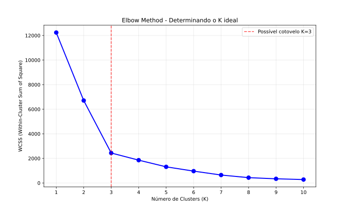
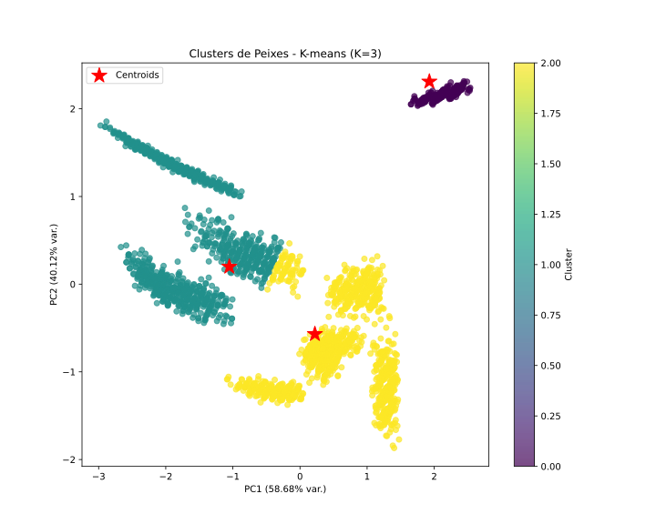

# Modelo de Machine Learning - K-Means

Para esse projeto, foi utilizado um dataset obtido no [**Kaggle**](https://kaggle.com){:target='_blank'}.
Os dados usados podem ser baixados [**aqui**](https://www.kaggle.com/datasets/taweilo/fish-species-sampling-weight-and-height-data){:target='_blank'}.

## Objetivo

O dataset utilizado possui dados sintéticamente gerados sobre peixes inspirados no papel [**Length-weight relationships of nine fish species from the Tetulia River, southern Bangladesh**](https://www.researchgate.net/figure/Descriptive-statistics-and-estimated-length-weight-relationship-W-aL-b-W-in-g-and-L_tbl1_280916140){:target='_blank'}. O objetivo do projeto é clusterizar esses peixes através, puramente, de suas características físicas.

## Workflow

Os pontos *"etapas"* são o passo-a-passo da realização do projeto.

### Etapa 1 - Exploração de Dados

Primeiramente, deve ser feita a exploração dos dados da base, com o objetivo de compreender a forma como são estruturados os dados e sua natureza.

O dataset é composto por **4080 linhas** e **4 colunas**, com cada linha representando uma peixe diferente. Essa verificação pôde ser feita com as linhas de código abaixo;

=== "Saída"

    ```python exec="1"
    --8<-- "docs/k-means/exploring-kmeans.py"
    ```

=== "Código"

    ```python exec="0"
    --8<-- "docs/k-means/exploring-kmeans.py"
    ```

#### Colunas do dataset

| Coluna | Tipo | Descrição |
|--------|------|-----------|
| species | String | Nome da espécie do peixe |
| length | Float | Comprimento do peixe em centímetros (cm) |
| weight | Float | Peso do peixe em gramas (g) |
| w_l_ratio | Float | Razão entre peso e comprimento (weight / length) |

#### Visualizações das variáveis

Em seguida, é essencial realizar gráficos para visualizar como cada uma das variáveis se comportam, com o objetivo de entender melhor a base da dados.

##### Variável `species` - Categórica

=== "Gráfico"

    ``` python exec="1" html="1"
    --8<-- "docs/k-means/visualizations/species.py"
    ```

=== "Código"

    ``` python exec="0"
    --8<-- "docs/k-means/visualizations/species.py"
    ```

É possível observar que há 9 espécies de peixe distintas, com uma distribuição muito semelhante entre elas. Com isso, podemos criar a hipótese de que essa base é fortemente compatível com clusterização de dados.

##### Variável `length` - Quantitativa Contínua

=== "Gráfico"

    ``` python exec="1" html="1"
    --8<-- "docs/k-means/visualizations/length.py"
    ```

=== "Código"

    ``` python exec="0"
    --8<-- "docs/k-means/visualizations/length.py"
    ```

##### Variável `weight` - Quantitativa Contínua

=== "Gráfico"

    ``` python exec="1" html="1"
    --8<-- "docs/k-means/visualizations/weight.py"
    ```

=== "Código"

    ``` python exec="0"
    --8<-- "docs/k-means/visualizations/weight.py"
    ```

##### Variável `w_l_ratio` - Quantitativa Contínua

=== "Gráfico"

    ``` python exec="1" html="1"
    --8<-- "docs/k-means/visualizations/w_l.py"
    ```

=== "Código"

    ``` python exec="0"
    --8<-- "docs/k-means/visualizations/w_l.py"
    ```

Com todas as análises realizadas, é possível entender os dados, suas frequências e distribuições. Com isso, podemos partir para o próximo passo.

### Etapa 2 - Pré-processamento

Nesta etapa, vamos fazer o pré-processamento dos dados. Para o K-Means, por ser um modelo não supervisionado de machine learning, não há necessidade de realizar a divisão de dados. Portanto, vamos aplicar o pré-processamento em toda a base.

#### 1° Passo: Remoção da coluna `species`

A coluna `species` da base já possui a divisão de cada um dos peixes por espécie. Portanto, vamos remover essa coluna e realizar a clusterização com os outros dados.

``` python
df = df.drop(columns=["species"])
```

#### 2° Passo: Identificação e tratamento de valores nulos

O primeiro passo para o pré-processamento é identificar e tratar valores nulos na base.

``` python exec="0"
print(df.isna().sum())
```

Executando a linha de código acima para o dataframe contendo os dados da base, foi possível identificar que não há valores nulos na base.

#### 3° Passo: Padronização dos dados

Em seguida, é necessária a padronização das features numéricas na base. Ao invés da normalização, será utilizada a técnica de padronização devido aos outliers nas features numéricas, principalmente as variáveis `weight` e `w_l_ratio`.
Para a padronização, utilizaremos o *StandardScaler()* do `scikit-learn`.

``` python exec="0"

from sklearn.preprocessing import StandardScaler

scaler = StandardScaler()

df = df.drop(columns=["species"])

X = scaler.fit_transform(df)

```

Como todas as features restantes após a remoção de `species` são numéricas contínuas, podemos simplesmente aplicar a padronização na base inteira de uma vez.

### Etapa 3 - Treinamento do Modelo

Agora, será realizado o treinamento do modelo. O objetivo dessa etapa é clusterizar os dados e inserir os peixes em seus grupos a partir da técnica de K-Means.

#### Elbow Method

Antes de treinar o modelo, é necessário descobrir o número de clusters que será utilizado. Para isso, aplicaremos o Elbow Method.

=== "Elbow"

    

=== "Código"

    ``` python exec="0"
    --8<-- "docs/k-means/elbow.py"
    ```

Podemos observar que, muito provavelmente, o cotovelo está em $k = 3$. Mesmo que saibamos que existem 9 espécies de peixes distintas na base, o Elbow Method nos mostra que os dados formam 3 grupos *naturais* baseados apenas nas medidas físicas, não nas espécies biológicas. Forçar um cluster para cada espécie, fazendo de $k = 9$, provavelmente resultará em *overfitting* e clusters ruins, já que as medidas podem não separar perfeitamente as 9 espécies.

#### Resultado do treinamento

=== "K-Means"

    <figure markdown="span">
        
        <figcaption>Silhouette Score: 0.6284</figcaption>
    </figure>

=== "Código"

    ``` python exec="0"
    --8<-- "docs/k-means/training-kmeans.py"
    ```

### Etapa 4 - Avaliação do modelo

#### Silhouette Score

O modelo alcançou um Silhouette Score de **0.6284**, indicando uma estrutura de clusters bem definida e distinta. Na escala de -1 a +1, este valor se enquadra na categoria *Boa* a *Forte*, sugerindo que os clusters possuem alta coesão interna e boa separação entre si, com sobreposição mínima entre os grupos.

#### Variância Explicada

O PCA aplicado para visualização explica **98.80%** da variância total dos dados, com o primeiro componente (PC1) capturando 58.68% e o segundo componente (PC2) 40.12%. Isso indica que a visualização 2D representa *fielmente* a estrutura multidimensional original dos dados de medidas dos peixes.

#### Insights Importantes sobre o Modelo

##### Padrão de Agrupamento Natural

- O K-means identificou 3 grupos naturais baseados apenas nas medidas físicas, não nas espécies biológicas

- Isso revela que diferentes espécies compartilham perfis dimensionais similares

##### Relação com Espécies Reais

A análise de correspondência mostra que:

- Cada cluster contém múltiplas espécies

- Espécies diferentes coexistem no mesmo cluster quando têm medidas similares

### Etapa 5 - Relatório Final

O projeto de clustering foi bem-sucedido em identificar padrões naturais nas medidas físicas de peixes. O K-means com K=3 demonstrou ser a configuração ideal para estes dados.

#### Possíveis Melhorias

- Análise discriminante: Verificar se as espécies são linearmente separáveis

- Matriz de confusão clusters×espécies: Quantificar a sobreposição entre agrupamentos

- Análise de features: Identificar quais medidas mais contribuem para cada cluster

#### Considerações Finais

O modelo K-means demonstrou ser eficaz para identificar padrões de tamanho em peixes baseado em suas medidas físicas. A descoberta mais interessante foi que o agrupamento natural dos dados (3 clusters) não corresponde às 9 espécies biológicas, revelando que diferentes espécies podem ter perfis dimensionais similares.

O Silhouette Score de 0.6284 confirma uma estrutura de clusters bem definida, com boa separação entre grupos e alta coesão interna.