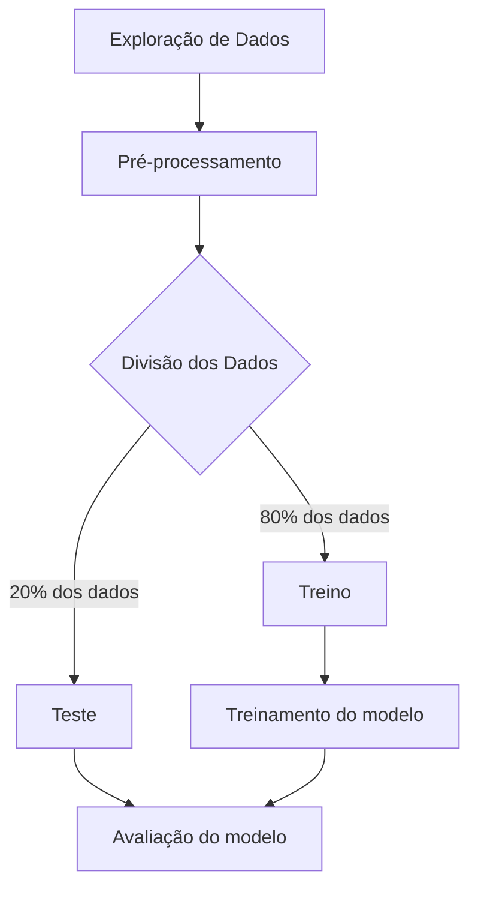
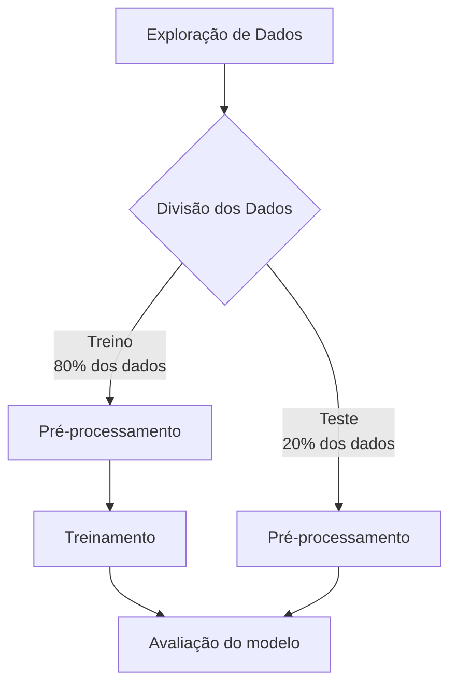
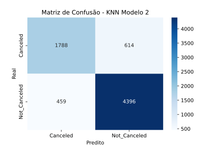

# Modelo de Machine Learning - KNN

Para esse projeto, foi utilizado um dataset obtido no [**Kaggle**](https://kaggle.com){:target='_blank'}.
Os dados usados podem ser baixados [**aqui**](https://www.kaggle.com/datasets/youssefaboelwafa/hotel-booking-cancellation-prediction/data){:target='_blank'}.

## Objetivo

O dataset utilizado possui informações sobre reservas em um hotel, e foi criado justamente para a criação de modelos de machine learning com o objetivo de prever se um agendamento será, ou não, cancelado.

Os dados originais para a criação desse dataset foram obtidos em um artigo de dados, no site [**Science Direct**](https://www.sciencedirect.com/){:target='_blank'}. O [**artigo em questão**](https://www.sciencedirect.com/science/article/pii/S2352340918315191) foi escrito por *Nuno Antonio*, *Ana de Almeida* e *Luis Nunes*, e contém uma quantidade maior de dados do que a sua versão derivada do **Kaggle**, que estou utilizando para este projeto.

## Workflow

Os pontos *"etapas"* são o passo-a-passo da realização do projeto.

### Etapa 1 - Exploração de Dados

Primeiramente, deve ser feita a exploração dos dados da base, com o objetivo de compreender a forma como são estruturados os dados, sua natureza e possível significância para o modelo de predição.

O dataset é composto por **36285 linhas** e **17 colunas**, com cada linha representando uma reserva distinta. Essa verificação pôde ser feita com as linhas de código abaixo;

=== "Saída"

    ```python exec="1"
    --8<-- "docs/knn/exploring-knn.py"
    ```

=== "Código"

    ```python exec="0"
    --8<-- "docs/knn/exploring-knn.py"
    ```

#### Colunas do dataset

| Coluna | Tipo | Descrição |
|--------|------|-----------|
| Booking_ID | String | Identificador único da reserva |
| number of adults | Inteiro | Número de adultos presentes na reserva |
| number of children | Inteiro | Número de crianças presentes na reserva |
| number of weekend nights | Inteiro | Quantidade de noites em finais de semana reservadas |
| number of week nights | Inteiro | Quantidade de noites em dias de semana reservadas |
| type of meal | String | Plano de alimentação escolhido pelo cliente |
| car parking space | Inteiro | Variável binária que indica se um estacionamento de carro foi pedido ou incluso na reserva |
| room type | String | Tipo de quarto reservado |
| lead time | Inteiro | Número de dias entre a data da reserva e a data de chegada do cliente |
| market segment type | String | Tipo de segmento do mercado associado à reserva |
| repeated | Inteiro | Variável binária que indica se a reserva é, ou não, repetida |
| P-C | Inteiro | Número de reservas anteriores que foram canceladas pelo cliente antes do agendamento atual |
| P-not-C | Inteiro | Número de reservas anteriores que não foram canceladas pelo cliente antes do agendamento atual |
| average price | Float | Preço médio associado à reserva |
| special requests | Inteiro | Número de pedidos especiais feitos pelo convidado(a) |
| date of reservation | String | Data da reserva |
| booking status | String | Status da reserva (cancelada ou não cancelada) |

#### Visualizações das variáveis

Em seguida, é essencial realizar gráficos para visualizar como cada uma das variáveis se comportam, com o objetivo de entender melhor a base da dados.

Está seção será divida para cada tipo de variável, entre variáveis quantitativas discretas, quantitativas contínuas, qualitativas categóricas, binárias e, por fim, a variável alvo.

##### Variáveis Quantitativas Discretas

=== "number of adults"

    === "Gráfico"

        ``` python exec="1" html="1"
        --8<-- "docs/knn/visualizations/number_adults.py"
        ```

    === "Código"

        ``` python exec="0"
        --8<-- "docs/knn/visualizations/number_adults.py"
        ```

=== "number of children"

    === "Gráfico"

        ``` python exec="1" html="1"
        --8<-- "docs/knn/visualizations/number_children.py"
        ```

    === "Código"

        ``` python exec="0"
        --8<-- "docs/knn/visualizations/number_children.py"
        ```

=== "number of weekend nights"

    === "Gráfico"

        ``` python exec="1" html="1"
        --8<-- "docs/knn/visualizations/weekend_nights.py"
        ```

    === "Código"

        ``` python exec="0"
        --8<-- "docs/knn/visualizations/weekend_nights.py"
        ```

=== "number of week nights"

    === "Gráfico"

        ``` python exec="1" html="1"
        --8<-- "docs/knn/visualizations/week_nights.py"
        ```

    === "Código"

        ``` python exec="0"
        --8<-- "docs/knn/visualizations/week_nights.py"
        ```

=== "lead time"

    === "Gráfico"

        ``` python exec="1" html="1"
        --8<-- "docs/knn/visualizations/lead_time.py"
        ```

    === "Código"

        ``` python exec="0"
        --8<-- "docs/knn/visualizations/lead_time.py"
        ```

=== "P-C"

    === "Gráfico"

        ``` python exec="1" html="1"
        --8<-- "docs/knn/visualizations/p_c.py"
        ```

    === "Código"

        ``` python exec="0"
        --8<-- "docs/knn/visualizations/p_c.py"
        ```

=== "P-not-C"

    === "Gráfico"

        ``` python exec="1" html="1"
        --8<-- "docs/knn/visualizations/p_not_c.py"
        ```

    === "Código"

        ``` python exec="0"
        --8<-- "docs/knn/visualizations/p_not_c.py"
        ```

=== "special requests"

    === "Gráfico"

        ``` python exec="1" html="1"
        --8<-- "docs/knn/visualizations/special_requests.py"
        ```

    === "Código"

        ``` python exec="0"
        --8<-- "docs/knn/visualizations/special_requests.py"
        ```

##### Variável Quantitativa Contínua **`average price`**

=== "Gráfico"

    ``` python exec="1" html="1"
    --8<-- "docs/knn/visualizations/average_price.py"
    ```

=== "Código"

    ``` python exec="0"
    --8<-- "docs/knn/visualizations/average_price.py"
    ```

##### Variáveis Categóricas

=== "type of meal"

    === "Gráfico"

        ``` python exec="1" html="1"
        --8<-- "docs/knn/visualizations/type_meal.py"
        ```

    === "Código"

        ``` python exec="0"
        --8<-- "docs/knn/visualizations/type_meal.py"
        ```

=== "room type"

    === "Gráfico"

        ``` python exec="1" html="1"
        --8<-- "docs/knn/visualizations/type_room.py"
        ```

    === "Código"

        ``` python exec="0"
        --8<-- "docs/knn/visualizations/type_room.py"
        ```

=== "market segment type"

    === "Gráfico"

        ``` python exec="1" html="1"
        --8<-- "docs/knn/visualizations/type_market.py"
        ```

    === "Código"

        ``` python exec="0"
        --8<-- "docs/knn/visualizations/type_market.py"
        ```

##### Variáveis Binárias

=== "car parking space"

    === "Gráfico"

        ``` python exec="1" html="1"
        --8<-- "docs/knn/visualizations/car_parking.py"
        ```

    === "Código"

        ``` python exec="0"
        --8<-- "docs/knn/visualizations/car_parking.py"
        ```

=== "repeated"

    === "Gráfico"

        ``` python exec="1" html="1"
        --8<-- "docs/knn/visualizations/repeated.py"
        ```

    === "Código"

        ``` python exec="0"
        --8<-- "docs/knn/visualizations/repeated.py"
        ```

##### Variável Alvo **`booking status`**

=== "Gráfico"

    ``` python exec="1" html="1"
    --8<-- "docs/knn/visualizations/booking_status.py"
    ```

=== "Código"

    ``` python exec="0"
    --8<-- "docs/knn/visualizations/booking_status.py"
    ```

Através das análises, foi possível alcançar uma compreensão mais aprofundada do funcionamento de cada uma das variáveis no dataset, além de haver insights valiosos nesses gráficos. Esses dados serão essenciais para a escolha das variáveis que serão utilizadas no modelo.

### Etapa 2 - Pré-processamento e Divisão de Dados

Neste projeto, após um estudo do pré-processamento e divisão de dados, foram considerados dois modelos distintos de pré-processamento. O primeiro modelo faz, primeiro, o pré-processamento, utilizando todo o dataset para treinar o modelo de predição. O segundo modelo cria o pré-processamento apenas com os dados de treinamento, evitando que o modelo tenha acesso indireto aos dados de teste, evitando [**data leakage**](https://www.kaggle.com/code/alexisbcook/data-leakage/tutorial){:target='_blank'}.

O primeiro modelo utiliza os dados de teste para realizar a padronização e substituição de valores nulos no dataset inteiro, fazendo com que, indiretamente, o modelo tenha acesso aos dados de teste. Esse problema pode afetar a acurácia do modelo com enviesamento, fazendo com que sua eficácia real seja diferente da testada. O segundo modelo trata os dados de teste como dados que nunca foram acessados pelo modelo. O pré-processamento, depois de feito a partir dos dados de treino, será aplicado aos dados de teste, inserindo-os no mesmo domínio do modelo para que possam ser realizadas predições. A hipótese principal é de que a acurácia do segundo modelo será um pouco menor, mas o modelo terá menos viés.

Abaixo, estão o diagramas de sequência representando cada modelo:

#### Modelo 1 - Pré-processamento -> Divisão dos Dados



#### Modelo 2 Divisão dos Dados -> Pré-processamento



Nos dois modelos, o pré-processamento é o mesmo. O que muda é o conjunto de dados em que ele é aplicado, sendo aplicado em todo o dataset no modelo 1 e apenas no conjunto de treino no modelo 2.

#### 1° Passo: Identificação e tratamento de valores nulos

O primeiro passo para o pré-processamento é identificar e tratar valores nulos na base.

``` python exec="0"
print(df.isna().sum())
```

Executando a linha de código acima para o dataframe contendo os dados da base, foi possível identificar que não há valores nulos na base.

#### 2° Passo: Remoção de colunas desimportantes

Em seguida, colunas que não são importantes para a predição serão removidas do dataframe. Essas colunas são `Booking_ID` e `date of reservation`. A forma que essa exclusão foi feita está representada abaixo:

``` python
df = df.drop(columns=["Booking_ID", "date of reservation"])
```

#### 3° Passo: Codificação de variáveis categóricas

O terceiro passo se consiste na codificação das variáveis categóricas. Essas são: `type of meal`, `room type` e `market segment type`.
Considerando a forma como a técnica do KNN funciona, calculando a distância euclidiana entre pontos para predizer, a técnica de label encoding seria ruim, pois os valores numéricos arbitrários poderiam criar distâncias falsas entre as categorias. Por isso, utilizaremos a técnica de One-Hot Encoding para codificar essas variáveis, utilizando o *OneHotEncoder()* do `scikit-learn`.

*Modelo 1:*

``` python exec="0"

from sklearn.preprocessing import OneHotEncoder

encoder = OneHotEncoder()
categorical_cols = ["type of meal", "room type", "market segment type"]

X = df.drop("booking status", axis=1)

X_encoded = encoder.fit_transform(X[categorical_cols])
encoded_df = pd.DataFrame(X_encoded.toarray(), columns=encoder.get_feature_names_out(categorical_cols), index=X.index)

X = pd.concat([X.drop(columns=categorical_cols), encoded_df], axis=1)

```

*Modelo 2:*

``` python exec="0"

from sklearn.preprocessing import OneHotEncoder

categorical_cols = ["type of meal", "room type", "market segment type"]

X = df.drop("booking status", axis=1)

X_train, X_test, y_train, y_test = train_test_split(X, y, test_size=0.2, random_state=42)

encoder = OneHotEncoder(drop="first", sparse_output=False)
encoder.fit(X_train[categorical_cols])

X_train_encoded = encoder.transform(X_train[categorical_cols])
X_test_encoded = encoder.transform(X_test[categorical_cols])

```

#### 4° Passo: Padronização das features numéricas 

Em seguida, é necessária a padronização das features numéricas na base. Ao invés da normalização, será utilizada a técnica de padronização devido aos outliers nas features numéricas, principalmente as variáveis `lead time` e `average price`, que desbalanceariam o cálculo de distâncias se apenas normalizadas.
Para a padronização, utilizaremos o *StandardScaler()* do `scikit-learn`.

*Modelo 1:*

``` python exec="0"

from sklearn.preprocessing import OneHotEncoder

scaler = StandardScaler()
numeric_cols = ["number of adults", "number of children", "number of weekend nights", 
                "number of week nights", "lead time", "P-C", "P-not-C", 
                "average price", "special requests"]

X = df.drop("booking status", axis=1)

for col in numeric_cols:
    X[col] = scaler.fit_transform(X[[col]])

```

*Modelo 2:*

``` python exec="0"

from sklearn.preprocessing import StandardScaler

numeric_cols = ["number of adults", "number of children", "number of weekend nights", 
                "number of week nights", "lead time", "P-C", "P-not-C", 
                "average price", "special requests"]

X_train, X_test, y_train, y_test = train_test_split(X, y)

scaler.fit(X_train)
X_train_scaled = scaler.transform(X_train)
X_test_scaled = scaler.transform(X_test)

```

#### 5° Passo: Codificação da variável alvo

Por fim, vamos codificar a variável alvo `booking status` utilizando a técnica de label encoding. Ou seja, após esse passo, "Not_Canceled" vai assumir o valor 1 e "Canceled" o valor 0. Aqui, essa técnica pode ser utilizada, pois essa é a variável alvo, e não será utilizada no cálculo das distâncias. Para codificar, utilizaremos o *LabelEncoder()* do `scikit-learn`.

*Modelo 1 e 2:*

``` python exec="0"

from sklearn.preprocessing import LabelEncoder

l_encoder = LabelEncoder()
y = l_encoder.fit_transform(df["booking status"])

```

#### Divisão dos dados

Como explicado anteriormente, essa etapa será realizada em momentos distintos dependendo do modelo utilizado. No primeiro modelo, esta etapa vem depois de todo o pré-processamento. No segundo modelo, esta etapa vem antes do pré-processamento.

- **Conjunto de Treino:** Utilizado para ensinar o modelo a reconhecer padrões

- **Conjunto de Teste:** Utilizado para avaliar o desempenho do modelo com dados ainda não vistos

Para realizar a divisão, foi utilizada a função *train_test_split()* do `scikit-learn`. Os parâmetros utilizados são:

- **test_size=0.2:** Define que 20% dos dados serão utilizados para teste, enquanto o restante será usado para treino.

- **random_state=42:** Parâmetro que controla o gerador de número aleatórios utilizado para sortear os dados antes de separá-los. Garante reprodutibilidade.

- **stratify=y:** Esse atributo definido como *y* é essencial devido à natureza da coluna `booking status`. Com essa definição, será mantida a mesma proporção das categorias em ambos os conjuntos, reduzindo o viés.

=== "Saída"

    ```python exec="1"
    --8<-- "docs/knn/division.py"
    ```

=== "Código"

    ```python exec="0"
    --8<-- "docs/knn/division.py"
    ```

Esta divisão adequada é de extrema importância, pois ajuda a evitar *overfitting*.

### Etapa 3 - Treinamento dos Modelos

Agora, será realizado o treinamento dos modelos. O objetivo dessa etapa é ensinar o algoritmo a reconhecer padrões nos dados que são fornecidos, e determinar se uma reserva será, ou não, cancelada de acordo com os dados das outras variáveis na base.

Para visualizar a eficácia dos modelos, foi aplicado um **PCA (Principal Component Analysis)** para definir as melhores variáveis a serem visualizadas. Além disso, foram feitas matrizes de confusão dos dois modelos.

#### Resultado dos treinamentos

*Modelo 1:*

=== "KNN - Modelo 1"

    <figure markdown="span">
        
        <figcaption>Acurácia: 0.8541</figcaption>
    </figure>

=== "Código"

    ```python exec="0"
    --8<-- "docs/knn/training_p-s.py"
    ```

*Modelo 2:*

=== "KNN - Modelo 2"

    <figure markdown="span">
        
        <figcaption>Acurácia: 0.8521</figcaption>
    </figure>

=== "Código"

    ```python exec="0"
    --8<-- "docs/knn/training_s-p.py"
    ```

### Etapa 4 - Avaliação dos modelos

#### Matrizes de confusão

Primeiramente, vamos observar as matrizes de confusão de ambos os modelos. A matriz de confusão consegue nos oferecer diversas métricas de qualidade do modelo, como o número de previsões correta para positivos e negativos, os falso positivos, falso negativos, a precisão, especificidade, dentre outras métricas.

*Modelo 1:*

=== "Matriz de confusão - Modelo 1"

    

=== "Código"

    ```python exec="0"
    --8<-- "docs/knn/confusion_p-s.py"
    ```

*Modelo 2:*

=== "Matriz de confusão - Modelo 2"

    

=== "Código"

    ```python exec="0"
    --8<-- "docs/knn/confusion_s-p.py"
    ```

#### Acurácia dos modelos

Os modelos tiveram uma acurácia muito próxima, ambas decentes, de 85,41% para o modelo 1 e 85,21% para o modelo 2.

#### Métricas de qualidade

*Modelo 1:*

- Precisão (Canceled): 1802 / (1802 + 600) = 75.03%

- Recall (Canceled): 1802 / (1802 + 459) = 79.70%

- F1-Score (Canceled): 77.30%

*Modelo 2:*

- Precisão (Canceled): 1788 / (1788 + 614) = 74.44%

- Recall (Canceled): 1788 / (1788 + 459) = 79.57%

- F1-Score (Canceled): 76.92%

#### Análise das visualizações

*Modelo 1:*

- Padrão visual: Separação mais "limpa" entre classes

- Componentes principais: Distribuição mais organizada

*Modelo 2:*

- Padrão visual: Separação mais realista entre classes

- Componentes principais: Sobreposição natural entre clusters

#### Avaliação detalhada entre os modelos

##### Modelo 1

*Pontos Fortes:*

- Acurácia ligeiramente superior (86.04% vs 85.80%)

- Melhor precision para classe "Canceled" (75.03% vs 74.44%)

- Separação visual mais clara no espaço PCA

*Pontos Fracos:*

- Performance artificialmente inflada

- Baixa confiabilidade para dados novos

- Não representa cenários do mundo real

##### Modelo 2

*Pontos Fortes:*

- Performance realista e confiável

- Melhor generalização para dados não vistos

- Aplicável em ambiente de produção

*Pontos Fracos:*

- Performance ligeiramente inferior em números absolutos

- Separação menos clara no espaço PCA

### Etapa 5 - Relatório Final

#### Recomendações e Conclusões

É recomendado o Modelo 2 (sem data leakage) porque:

- Fornece estimativas realistas de performance

- É mais robusto para dados novos

- Evita surpresas desagradáveis em produção

- Mantém performance muito similar (diferença de apenas 0.2%)

#### Pontos Importantes Observados

- Data leakage cria uma falsa sensação de segurança

- Diferenças pequenas em métricas podem indicar problemas grandes

- A validação rigorosa é essencial para modelos confiáveis

- Performance visual nem sempre se traduz em performance real

#### Possíveis próximos passos e melhorias

- Validar ambos modelos em um conjunto de dados totalmente novo

- Implementar o Modelo 2 em ambiente controlado

- Monitorar performance contínua em produção

- Considerar técnicas de regularização para melhorar generalização

#### Conclusão Final

Embora o Modelo 1 apresente métricas ligeiramente superiores, o Modelo 2 é significativamente mais confiável e adequado para implantação em ambiente real devido à ausência de data leakage.