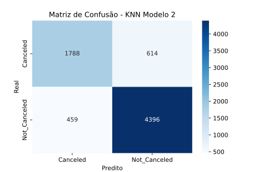
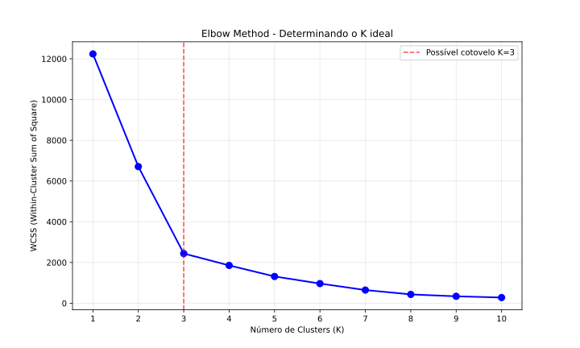

# Métricas de Qualidade e Avaliação dos modelos KNN e K-Means

Aqui, vou documentar mais especificamente e com mais informações as métricas e avaliação desses dois modelos.

## Modelo KNN 

Primeiramente, vamos começar com o modelo KNN. O dataset utilizado possui informações sobre reservas em um hotel, e foi utilizado para prever se um agendamento será, ou não, cancelado. No KNN, foi feito um estudo utilizando dois modelos distintos, já explicados no projeto. Portanto, todas as métricas de qualidade serão aplicadas separadamente para ambos os modelos.

### Resultados do *Modelo 1*

O *Modelo 1* pode ser visualizado da seguinte forma:


Seu resultado pode ser visualizado abaixo:

<figure markdown="span">
    
    <figcaption>Acurácia: 0.8541</figcaption>
</figure>

### Métricas para o *Modelo 1*

Agora, vamos descrever as métricas para o modelo, e explicá-las.

#### Matriz de Confusão


A matriz de confusão consegue nos oferecer diversos valores que serão utilizados para calcular as métricas de qualidade.

#### Métricas de Qualidade

=== "Métricas - Modelo 1"

    ```python exec="1"
    --8<-- "docs/metrics/modelo1.py"
    ```

=== "Código"

    ```python exec="0"
    --8<-- "docs/metrics/modelo1.py"
    ```

O modelo apresenta desempenho sólido com acurácia de 85.41%, indicando boa capacidade geral de classificação.

##### Pontos Fortes

- Alta Sensibilidade (90.55%): Excelente em identificar casos positivos (apenas 9.45% de falsos negativos)

- Boa Precisão (87.99%): Quando prediz positivo, está correto 88% das vezes

- Alto VP Negativo (79.70%): Boa confiabilidade nas predições negativas

##### Áreas de Atenção

- Especificidade Moderada (75.02%): O modelo tem dificuldade em identificar corretamente os casos negativos

- Taxa de Falsos Positivos (24.98%): Relativamente alta - 1 em cada 4 predições positivas está errada

#### Curva ROC e AUC

=== "Curva ROC"

    <figure markdown="span">
        
        <figcaption>AUC (Area Under Curve): 0.8891</figcaption>
    </figure>

=== "Código"

    ```python exec="0"
    --8<-- "docs/metrics/roc1.py"
    ```

o AUC obtido, de 88,91%, é classificado como **excelente** na escala de discriminação, estando bem acima da linha do acaso e muito próximo do canto superior esquerdo do gráfico, o que indica bom trade-off entre sensibilidade e especificidade.

### Resultados do *Modelo 2*

O *Modelo 2* pode ser visualizado da seguinte forma:


Seu resultado pode ser visualizado abaixo:

<figure markdown="span">
    
    <figcaption>Acurácia: 0.8521</figcaption>
</figure>>

### Métricas para o *Modelo 2*

Agora, vamos descrever as métricas para o modelo, e explicá-las.

#### Matriz de Confusão



A matriz de confusão consegue nos oferecer diversos valores que serão utilizados para calcular as métricas de qualidade.

#### Métricas de Qualidade

=== "Métricas - Modelo 2"

    ```python exec="1"
    --8<-- "docs/metrics/modelo2.py"
    ```

=== "Código"

    ```python exec="0"
    --8<-- "docs/metrics/modelo2.py"
    ```

A acurácia, pontos fortes e pontos de atenção são todos extremamente semelhantes ao modelo anterior, com variações nas métricas abaixo de 1% em todos os casos.

#### Curva ROC e AUC

=== "Curva ROC"

    <figure markdown="span">
        
        <figcaption>AUC (Area Under Curve): 0.8876</figcaption>
    </figure>

=== "Código"

    ```python exec="0"
    --8<-- "docs/metrics/roc1.py"
    ```

o AUC obtido, de 88,76%, é classificado como **excelente** na escala de discriminação, da mesma forma que o AUC do modelo 1. Novamente, uma diferença minúscula entre as métricas dos dois modelos, com variação de apenas 0,15%.

## Modelo K-Means

Agora, faremos a análise do modelo K-Means. O dataset utilizado possui dados sintéticamente gerados sobre peixes. O objetivo do projeto foi clusterizar esses peixes através, puramente, de suas características físicas.

### Elbow Method

Antes do treinamento do modelo, foi necessário descobrir o número de clusters que seriam utilizado. Para isso, foi aplicado o Elbow Method, que definiu o número de cluster em $k = 3$, destacando que a separação puramente física se diverge da separação de espécies biológicas, já que existem 9 espécies de peixes distintas na base de dados.

=== "Elbow"

    

=== "Código"

    ``` python exec="0"
    --8<-- "docs/k-means/elbow.py"
    ```

### Resultados do modelo

<figure markdown="span">
    
    <figcaption>Silhouette Score: 0.6284</figcaption>
</figure>

### Métricas para o modelo

#### Silhouette Score

O modelo alcançou um Silhouette Score de **0.6284**, indicando uma estrutura de clusters bem definida e distinta. Na escala de -1 a +1, este valor se enquadra na categoria *Boa* a *Forte*, sugerindo que os clusters possuem alta coesão interna e boa separação entre si, com sobreposição mínima entre os grupos.

#### Variância Explicada

O PCA aplicado para visualização explica **98.80%** da variância total dos dados, com o primeiro componente (PC1) capturando 58.68% e o segundo componente (PC2) 40.12%. Isso indica que a visualização 2D representa *fielmente* a estrutura multidimensional original dos dados de medidas dos peixes.

#### Tamanho dos Clusters

A distribuição de peixes entre os clusters pode ser visualizada com o código abaixo:

=== "Cluster size"

    ``` python exec="1"
    --8<-- "docs/metrics/cluster-size.py"
    ```

=== "Código"

    ``` python exec="0"
    --8<-- "docs/metrics/cluster-size.py"
    ```

Dessa distribuição, podemos tirar alguns *pontos positivos*:

- Nenhum cluster minúsculo (todos acima de 10% dos dados)

- Distribuição progressiva - clusters bem diferenciados em tamanho

- Sem clusters extremamente desbalanceados

Além disso, foi identificado um *padrão*:

- Cluster 2 (56.3%) → Maior grupo

- Cluster 1 (32.2%) → Grupo intermediário

- Cluster 0 (11.1%) → Menor grupo

## Conclusão

A análise comparativa dos modelos KNN e K-Means revelou insights valiosos sobre suas respectivas aplicações e desempenhos. O KNN demonstrou excelente capacidade preditiva para classificação de cancelamentos de reservas hoteleiras, com ambos os modelos (com e sem data leakage) apresentando métricas sólidas - acurácia acima de 85% e AUC superior a 88%, indicando robustez na discriminação entre classes.

Já o K-Means mostrou-se eficaz na identificação de padrões naturais em dados de medidas físicas de peixes, formando 3 clusters bem definidos com Silhouette Score de 0.6284. A descoberta mais significativa foi que o agrupamento natural por características físicas difere da classificação biológica por espécies, revelando que diferentes espécies compartilham perfis dimensionais similares.

Ambos os algoritmos comprovaram seu valor: o KNN como ferramenta confiável para problemas de classificação supervisionada, e o K-Means como método eficaz para descoberta de padrões intrínsecos em dados não rotulados, cada um atendendo a objetivos distintos com performances satisfatórias em seus respectivos contextos.