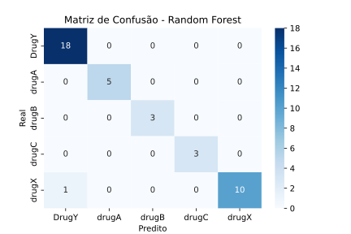

# Modelo de Machine Learning - KNN

Para esse projeto, foi utilizado um dataset obtido no [**Kaggle**](https://kaggle.com){:target='_blank'}.
Os dados usados podem ser baixados [**aqui**](https://www.kaggle.com/datasets/prathamtripathi/drug-classification){:target='_blank'}.

## Objetivo

O dataset utilizado possui informações sobre pacientes sob efeito de drogas farmacêuticas. O objetivo da predição é prever o tipo de droga baseado nas features do modelo.

## Workflow

Os pontos *"etapas"* são o passo-a-passo da realização do projeto.

### Etapa 1 - Exploração de Dados

Primeiramente, deve ser feita a exploração dos dados da base, com o objetivo de compreender a forma como são estruturados os dados, sua natureza e possível significância para o modelo de predição.

O dataset é composto por **200 linhas** e **6 colunas**, com cada linha representando um paciente distinto. Essa verificação pôde ser feita com as linhas de código abaixo;

=== "Saída"

    ```python exec="1"
    --8<-- "docs/random-forest/exploring_rf.py"
    ```

=== "Código"

    ```python exec="0"
    --8<-- "docs/random-forest/exploring_rf.py"
    ```

#### Colunas do dataset

| Coluna | Tipo | Descrição |
|--------|------|-----------|
| Age | Inteiro | Idade do paciente |
| Sex | String | Gênero do paciente |
| BP | String | Níveis de pressão sanguínea |
| Cholesterol | String | Níveis de colesterol |
| Na_to_K | Float | Razão do sódio para o potássio no sangue |
| Drug | String | Tipo de droga |

#### Visualizações das variáveis

Em seguida, é essencial realizar gráficos para visualizar como cada uma das variáveis se comportam, com o objetivo de entender melhor a base da dados.

Está seção será divida para cada tipo de variável, entre variáveis quantitativas discretas, quantitativas contínuas, categóricas e, por fim, a variável alvo.

##### Variáveis Categóricas

=== "Sex"

    === "Gráfico"

        ``` python exec="1" html="1"
        --8<-- "docs/random-forest/visualizations/sex.py"
        ```

    === "Código"

        ``` python exec="0"
        --8<-- "docs/random-forest/visualizations/sex.py"
        ```

=== "BP"

    === "Gráfico"

        ``` python exec="1" html="1"
        --8<-- "docs/random-forest/visualizations/bp.py"
        ```

    === "Código"

        ``` python exec="0"
        --8<-- "docs/random-forest/visualizations/bp.py"
        ```

##### Variável Quantitativa Discreta **`Age`**

=== "Gráfico"

    ``` python exec="1" html="1"
    --8<-- "docs/random-forest/visualizations/age.py"
    ```

=== "Código"

    ``` python exec="0"
    --8<-- "docs/random-forest/visualizations/age.py"
    ```

##### Variável Quantitativa Contínua **`Na_to_K`**

=== "Gráfico"

    ``` python exec="1" html="1"
    --8<-- "docs/random-forest/visualizations/natok.py"
    ```

=== "Código"

    ``` python exec="0"
    --8<-- "docs/random-forest/visualizations/natok.py"
    ```

##### Variável Alvo **`Drug`**

=== "Gráfico"

    ``` python exec="1" html="1"
    --8<-- "docs/random-forest/visualizations/drug.py"
    ```

=== "Código"

    ``` python exec="0"
    --8<-- "docs/random-forest/visualizations/drug.py"
    ```

Através das análises, foi possível alcançar uma compreensão mais aprofundada do funcionamento de cada uma das variáveis no dataset, além de haver insights valiosos nesses gráficos.

### Etapa 2 - Pré-processamento

Nessa etapa, vamos tratar a base para uso no treinamento do modelo.

#### 1° Passo: Identificação e tratamento de valores nulos

O primeiro passo para o pré-processamento é identificar e tratar valores nulos na base.

``` python exec="0"
print(df.isna().sum())
```

Executando a linha de código acima para o dataframe contendo os dados da base, foi possível identificar que não há valores nulos na base.

#### 2° Passo: Codificação de variáveis categóricas

O segundo passo se consiste na codificação das variáveis categóricas. Essas são: `Sex`, `BP` e `Cholesterol`.
Utilizaremos a técnica de One-Hot Encoding para codificar essas variáveis, utilizando o *OneHotEncoder()* do `scikit-learn`.

``` python exec="0"

from sklearn.preprocessing import OneHotEncoder

encoder = OneHotEncoder()
categorical_cols = ["Sex", "BP", "Cholesterol"]

X = df.drop("Drug", axis=1)

X_encoded = encoder.fit_transform(X[categorical_cols])
encoded_df = pd.DataFrame(X_encoded.toarray(), columns=encoder.get_feature_names_out(categorical_cols), index=X.index)

X = pd.concat([X.drop(columns=categorical_cols), encoded_df], axis=1)

```

#### 3° Passo: Padronização das features numéricas

Em seguida, é necessária a padronização das features numéricas na base. Utilizaremos o *StandardScaler()* do `scikit-learn` para padronizar as variáveis `Na_to_K` e `Age`.

``` python exec="0"

from sklearn.preprocessing import StandardScaler

scaler = StandardScaler()
numeric_cols = ["Age", "Na_to_K"]

X = df.drop("Drug", axis=1)

X_scaled = scaler.fit_transform(X[numeric_cols])
scaled_df = pd.DataFrame(X_scaled, columns=numeric_cols, index=X.index)

X = pd.concat([X.drop(columns=numeric_cols), scaled_df], axis=1)

```

#### 4° Passo: Codificação da variável alvo

Por fim, vamos codificar a variável alvo `Drug` utilizando a técnica de label encoding. Para codificar, utilizaremos o *LabelEncoder()* do `scikit-learn`.

``` python exec="0"

from sklearn.preprocessing import LabelEncoder

encoder = LabelEncoder()
y = encoder.fit_transform(df["Drug"])

```

### Etapa 3 - Divisão dos dados

Em seguida, vamos realizar a divisão dos dados em conjuntos de *treino* e *teste*.

- **Conjunto de Treino:** Utilizado para ensinar o modelo a reconhecer padrões

- **Conjunto de Teste:** Utilizado para avaliar o desempenho do modelo com dados ainda não vistos

Para realizar a divisão, foi utilizada a função *train_test_split()* do `scikit-learn`. Os parâmetros utilizados são:

- **test_size=0.2:** Define que 20% dos dados serão utilizados para teste, enquanto o restante será usado para treino.

- **random_state=42:** Parâmetro que controla o gerador de número aleatórios utilizado para sortear os dados antes de separá-los. Garante reprodutibilidade.

- **stratify=y:** Esse atributo definido como *y* é essencial devido à natureza da coluna `Drug`. Com essa definição, será mantida a mesma proporção das categorias em ambos os conjuntos, reduzindo o viés.

=== "Saída"

    ```python exec="1"
    --8<-- "docs/random-forest/division.py"
    ```

=== "Código"

    ```python exec="0"
    --8<-- "docs/random-forest/division.py"
    ```

Esta divisão adequada é de extrema importância, pois ajuda a evitar *overfitting*.

### Etapa 4 - Treinamento do Modelo

Agora, será realizado o treinamento do modelo. O objetivo dessa etapa é ensinar o algoritmo a reconhecer padrões nos dados que são fornecidos, e prever o tipo de droga presente no sangue dos pacientes através das features do modelo.

=== "Saída"

    ```python exec="1" html="1"
    --8<-- "docs/random-forest/training.py"
    ```

=== "Código"

    ```python exec="0"
    --8<-- "docs/random-forest/training.py"
    ```

### Etapa 5 - Avaliação do modelo

Nessa etapa, vamos avaliar os resultados obtidos pelo modelo **Random Forest**.

#### Acurácia do modelo

Como é possível observar acima na etapa de treinamento do modelo, o modelo atingiu uma alta acurácia, de **97,5%**, indicando que, possivelmente, o modelo sofre de *overfitting*. Ou seja, existe a chance do modelo estar apenas memorizando os dados ao invés de entendê-los, devido a um possível ruído dos dados de treino.
Por isso, vamor realizar um teste de validação cruzada para testar se o modelo sofre desse problema.

#### Teste de validação cruzada

=== "Saída"

    ```python exec="1"
    --8<-- "docs/random-forest/cross-val.py"
    ```

=== "Código"

    ```python exec="0"
    --8<-- "docs/random-forest/cross-val.py"
    ```

O modelo demonstra excelente generalização, com acurácia média de **98%** na *validação cruzada*, ligeiramente superior aos **97,5%** obtidos no *teste inicial*. A consistência entre os folds é **alta**, com quatro deles alcançando **100% de acurácia** e apenas um apresentando **90%**.

A pequena variação (de aproximadamente 8%) entre os folds e a diferença insignificante de 0,5% entre a validação cruzada e o teste original indicam que não há evidências de *overfitting*. O modelo mostra **robustez** e **capacidade de generalização** adequada para os dados.

#### Importância das features

Agora, vamos analisar a importância das features do modelo.

- As variáveis mais importantes para a predição foram `Na_to_K`, `BP_HIGH` e `Age`.

- Foi possível observar que as variáveis dummy `Sex_M` e `Sex_F` possuem relevância muito mínima para a predição, de **1,32%** e **0,93%**, respectivamente.

#### Matriz de confusão e Métricas de Qualidade

Em seguida, vamos analisar a matriz de confusão e obter as métricas de avaliação:

=== "Matriz de Confusão"

    *Matriz de confusão*

    

    *Métricas de qualidade*

    ``` python exec="1"
    --8<-- "docs/random-forest/cm.py"
    ```

=== "Código"

    ``` python exec="0"
    --8<-- "docs/random-forest/cm.py"
    ```

Como é possível observar acima, o modelo possui excelentes métricas de qualidade, já que das 40 amostras no conjunto de teste, apenas uma foi prevista incorretamente.

### Etapa 6 - Relatório Final

Para finalizar o projeto, vamos ao relatório final do modelo:

#### Recomendações e Conclusões

O modelo **Random Forest** desenvolvido demonstra **excelente desempenho** e está pronto para uso em um *ambiente controlado*. Recomenda-se sua implementação para classificação de medicamentos com base nas características dos pacientes, considerando sua *alta acurácia* e *robustez* comprovadas.

#### Pontos Importantes Observados

- **Alta performance:** O modelo alcançou **97,5%** de acurácia no teste inicial e **98%** na validação cruzada

- **Boa generalização:** A validação cruzada confirmou a ausência de *overfitting* significativo

- **Feature mais relevante:** A variável `Na_to_K` mostrou-se como a mais importante para predição

#### Possíveis Próximos Passos e Melhorias

- **Coleta de mais dados:** Expandir o dataset para aumentar a robustez do modelo

- **Engenharia de features:** Explorar combinações entre variáveis existentes

- **Validação externa:** Testar o modelo com dados de fontes diferentes

#### Conclusão Final

O projeto atingiu plenamente seu objetivo de desenvolver um *modelo preditivo eficaz* para classificação de medicamentos. O **Random Forest** mostrou-se como uma escolha adequada, entregando resultados consistentes e confiáveis. A abordagem metodológica adotada, desde a exploração inicial até a validação rigorosa, garantiu a qualidade do modelo final, que se apresenta como uma **solução viável** para o problema proposto.